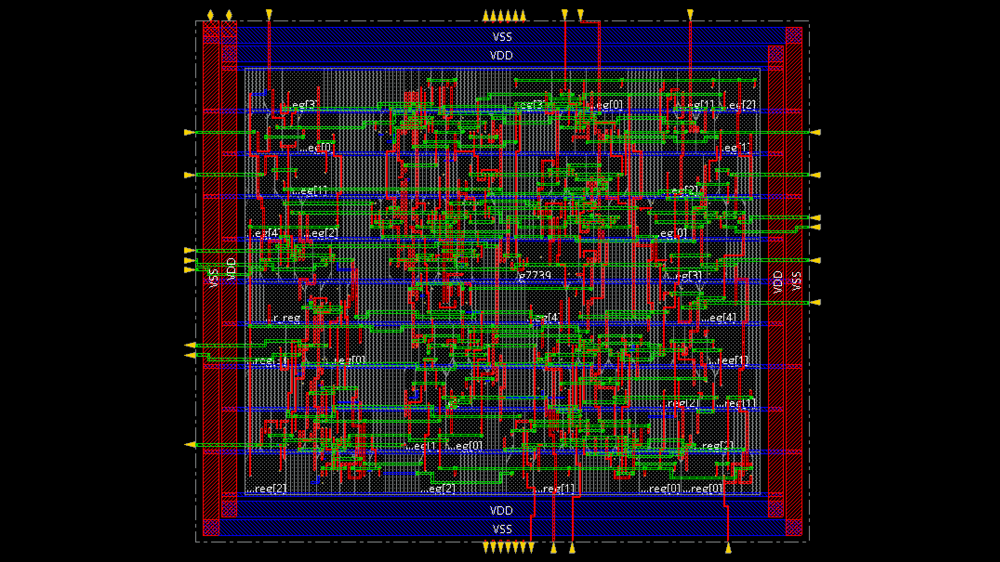

# Trading_Signal_Generator_Chip

I used my prior [repository](https://github.com/maxj723/DIC_Trading_Signal_Generator) to build the chip layout for the .def file.   

First, I slightly modified day_trading.v to use a different clock signal for two latches instead of a flip-flop. This is because the muddlib lef library does not support flops.   
Next, I built trader_synth.tcl to use genus and convert the day_trading.v into day_trading_m.v for Innovus (library from muddlib.lef).   
Afterward, I used Innovus to build the layout from day_trading_m.v. This save is at day_trading_floorplan.enc.   
   
Finally, I finished with day_trading.def. I plan to possibly add a padframe and finish with a GDSII file for tapeout.   
